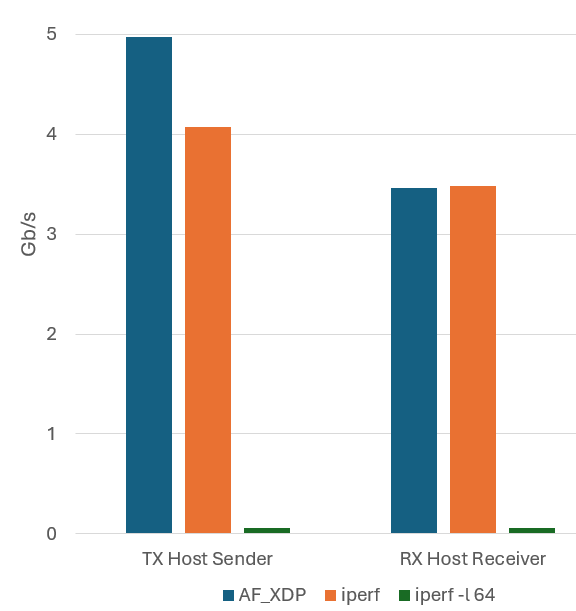
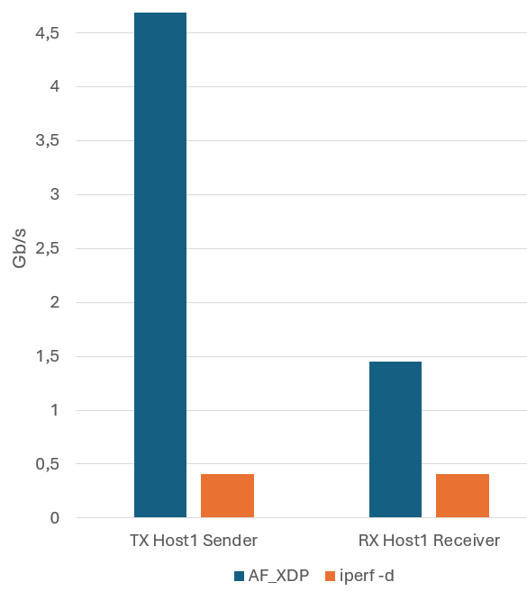
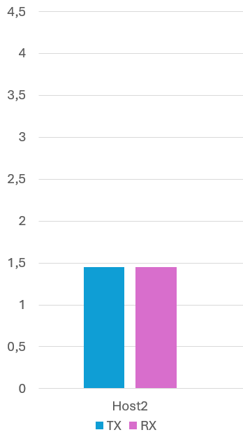

# Appunti XDPsock - AF_XDP Performance Tool

AF_XDP è un'interfaccia socket che permette di raggiungere prestazioni di rete ad alta velocità attraverso il kernel bypass. Il programma **xdpsock** implementa un tool di testing delle prestazioni di rete basato su AF_XDP per la valutazione di throughput e latenza.

Flag:
- `-i <if>`: Interfaccia di rete
- `-q <n>`: Coda (default: 0)  
- `-d <sec>`: Durata test
- `-z`: Zero-copy mode
- `-S`: XDP-SKB mode
- `-N`: XDP-native mode

### Modalità

L'applicazione offre tre modalità principali:

1. **RXPROCESS** (`-r`): Analisi dei pacchetti in ricezione con calcolo di RTT e jitter 
2. **TXONLY** (`-t`): Trasmissione continua per test di throughput
3. **ECHO** (`-l`): Server echo che risponde alle richieste

### Gestione della Memoria

- **UMEM**: 8K frame da 4KB condivisi tra applicazione e kernel
- **Ring Buffer**: RX, TX, FILL e COMPLETION queue per trasferimento lock-free
- **Batch Processing**: Elaborazione a gruppi di 64 pacchetti 

## Implementazione
Il programma kernel necessario per intercettare i pacchetti e inviarli allo userspace viene caricato dalle librerie `libbpf/libxdp` al momento della creazione della socket AF_XDP (se non già presente sulla NIC). Supporta diverse modalità di binding che definiscono sia il path di elaborazione dei pacchetti nel kernel (`XDP_NATIVE`, `XDP_SKB`) sia la gestione della memoria lato userspace (default: `XDP_COPY`, `XDP_ZEROCOPY`).  

### Zero-Copy Mode
La modalità zero-copy (`-z`) elimina le copie di memoria tra kernel e user space attraverso l'accesso diretto all'UMEM condivisa, in questo modo operano sulla stessa area di memoria, riducendo drasticamente l'overhead di trasferimento dati. 
Questa modalità offre prestazioni massime ma richiede supporto specifico del driver di rete. In caso di incompatibilità, il sistema utilizza automaticamente la modalità copy come fallback.

### Batch Processing
Il programma elabora pacchetti in gruppi di 64 (`BATCH_SIZE = 64`). Questo permette meno chiamate di sistema e transizioni kernel/user space. 
<!--    - TX: `xsk_ring_prod__reserve()` riserva 64 slot simultaneamente
   - RX: `xsk_ring_cons__peek()` legge fino a 64 pacchetti per ciclo -->

#### Struttura dei Pacchetti
<!-- Formato: Ethernet (14B) + IP (20B) + UDP (8B) + Payload (16B)
 -->
Payload:
- **Sequence** (4B): Numero di sequenza per tracking
- **Timestamp** (8B): Per calcolo RTT
- **Type/Data** (4B): REQUEST/RESPONSE + dati aggiuntivi
<!-- Potremmo analizzare diverse dimensione dei pacchetti per vedere quale ha migliori prestazioni -->

<!-- ## Strategie di Polling
Il programma implementa due approcci per gestire eventi sui socket AF_XDP, selezionabili tramite l'opzione `-p`:

#### Poll() Mode
Quando il programma viene eseguito con l’opzione `-p`, utilizza la syscall `poll()` per attendere l’arrivo di pacchetti:
- Il processo si blocca in `poll()` delegando al kernel il monitoraggio dei socket.
- Il kernel sblocca il processo solo quando:
    - sono disponibili pacchetti 
    - oppure scade il timeout (default: 1 secondo).
- L’arrivo dei pacchetti è segnalato da interrupt hardware.
- Si verificano **context switch** ad ogni ricezione: dal kernel (interrupt handler) all’applicazione in user space.
- Introduce **latenza aggiuntiva** dovuta a:
    - gestione dell’interrupt.
    - overhead di risveglio del processo.
- Tuttavia comporta un basso utilizzo CPU durante i periodi idle, a scapito della latenza.

#### Busy Polling
Quando il programma viene eseguito senza l’opzione `-p`, utilizza la modalità **busy polling**:
- Nessun interrupt hardware per segnalare l’arrivo di pacchetti: **l’applicazione interroga direttamente la NIC**, leggendo i ring buffer AF_XDP in un ciclo continuo.
- **Assenza di context switch** tra kernel space e userspace per la ricezione (se driver e applicazione sono sullo stesso core).
- Cache locality ottimale: i pacchetti elaborati dal driver restano nelle cache L1/L2 del core per essere immediatamente letti dall’applicazione.
- Latenza più bassa e più stabile grazie all’eliminazione della gestione interrupt e del risveglio del processo.
- Alto utilizzo CPU sul core dedicato. -->
<!-- Magari aggiungi comparazione utilizzo cache -->

<!-- ## Metriche Raccolte
- **Throughput**: pps e Mbps in TX/RX
- **RTT**: Min/Avg/Max round trip time
- **Jitter**: Variabilità del RTT
- **Packet Loss**: Percentuale e conteggio
- **Out-of-order**: Pacchetti fuori sequenza -->

<!-- ## Invio Pacchetti (TX)

1. **Preparazione**: 
   - Generazione template pacchetto con `gen_eth_frame()` nell'UMEM
   - Aggiornamento sequence number e timestamp per ogni invio

2. **Trasmissione**:
   - `xsk_ring_prod__reserve()`: Riserva slot nel TX ring
   - Configurazione descrittori con indirizzo frame e lunghezza
   - `xsk_ring_prod__submit()`: Sottomette batch al kernel
   - `kick_tx()`: Trigger invio via `sendto()`

3. **Completion**:
   - `complete_tx_*()`: Controlla completion queue
   - Rilascio frame completati nella pool libera
   - Aggiornamento contatori TX

## Ricezione Pacchetti (RX)

1. **Rifornimento**:
   - `xsk_ring_prod__reserve()` su FILL queue
   - Inserimento indirizzi frame liberi per ricezione
   - `xsk_ring_prod__submit()`: Frame disponibili al kernel

2. **Ricezione**:
   - `xsk_ring_cons__peek()`: Controlla nuovi pacchetti in RX ring
   - Accesso diretto ai dati via `xsk_umem__get_data()`
   - Parsing payload per sequence/timestamp/type

3. **Processing**:
   - **ECHO**: `swap_addresses()` + `convert_to_response()`
   - **RXPROCESS**: Calcolo RTT, tracking loss/jitter
   - `xsk_ring_cons__release()`: Rilascio descrittori processati -->

<!-- ### Gestione Memoria          

- **Frame Pool**: Pool circolare di indirizzi UMEM liberi
- **Zero-Copy**: Accesso diretto senza copie intermedie
- **Batch Operations**: Elaborazione gruppi per ridurre overhead
- **Ring Synchronization**: Produttore-consumatore lock-free -->

## Caso di Studio
Questa prima parte dell'attività ha lo scopo di analizzare le prestazione delle socket AF_XDP con l’obiettivo di comprendere come XDP permetta di bypassare il kernel nella gestione dei pacchetti.

Per fare ciò, è stato sviluppato un programma tipo iperf, basato su un meccanismo ping-pong, che invia pacchetti tra due macchine misurando il throughput medio e il tempo di round-trip (RTT).

Sul primo host, il meccanismo di trasmissione e ricezione è stato realizzato mediante due istanze separate, in modo da dedicare interamente a ciascuna un core e una queue della NIC, massimizzando l’isolamento e le prestazioni.

Sul secondo host, invece, l’elaborazione e il forwarding dei pacchetti sono stati gestiti all’interno di un unico programma, così da sfruttare la cache locality derivante dall’uso della UMEM comune tra TX ring e RX ring.

### Prestazioni
Un primo confronto delle performance è stato effettuato con il tool `iperf`. Questa misurazione fornisce un riferimento sulle capacità della rete quando si utilizza lo stack kernel standard, consentendo di quantificare l’eventuale miglioramento ottenuto con l’impiego di XDP e delle socket AF_XDP.

Poiché iperf classico effettua uno scambio dati `one-way`, il primo passo del confronto riguarda le prestazioni di trasmissione tra il programma XDP in modalità sender sulla prima macchina e quello in modalità receiver sulla seconda, così da avere un parallelismo diretto con il modello di invio puro.
I programmi XDP sono stati eseguiti in modalità `zero-copy` e `busy-polling`, utilizzando pacchetti della dimensione di 64 byte e la durata di esecuzione del test è di 10 secondi. Nel confronto con il tool `iperf` va considerato che, di default, la dimensione dei pacchetti utilizzati non è di 64 byte, ma tipicamente di 1460 byte per UDP. Provando a impostare la dimensione dei pacchetti alla stessa del nostro test (`iperf -l 64`), si sono tuttavia riscontrate prestazioni deludenti (63,3 Mbits/sec), principalmente a causa dell’elevato numero di pacchetti piccoli da gestire, che ne limita l’efficienza del trasferimento. 

  

Possiamo notare come nella modalità di trasmissione il programma XDP raggiunga una media di 4,98 Gbits/sec mentre iperf si limita a 4.08 Gbits/sec. Invece nel secondo host nella modalità di ricezione la media delle prestazioni è più simile: 3,46 Gbits/sec per AF_XDP e 3,48 Gbits/sec per `iperf`.

Successivamente, al fine di considerare un confronto più pertinente con il meccanismo di request-response del nostro programma XDP consideriamo la modalità bidirezionale di `iperf`: `iperf -d` pur non essendo pienamente equivalente a un modello ping-pong (in quanto genera due flussi indipendenti, uno per direzione, e non uno scambio sequenziale), consente comunque di valutare in modo comparativo le capacità di throughput bidirezionale.

  
  

Nel secondo contesto viene introdotto dell'overhead causato dal secondo host, nel quale il programma che esegua forwarding dei pacchetti ha un bitrate TX di 1,454 Gbits/sec. Di conseguenza, il programma ricevente sul primo host ha un throughput di 1,453 Gbits/sec in RX.
Le prestazioni del tool `iperf` in modalità dual (bidirezionale) risultano essere invece notevolmente inferiori: una media 0,40 Gbits/sec sia in ricezione che trasmissione. 

Risulta quindi significativo l’overhead causato dall’elaborazione lato server sul secondo host, che riduce significativamente il bitrate e ha conseguenze sull’RTT: 0,467 ms RTT medio, con un minimo di 0,043 ms e un massimo di 11,418 ms. Il jitter medio risulta essere di 0,357 µs.

